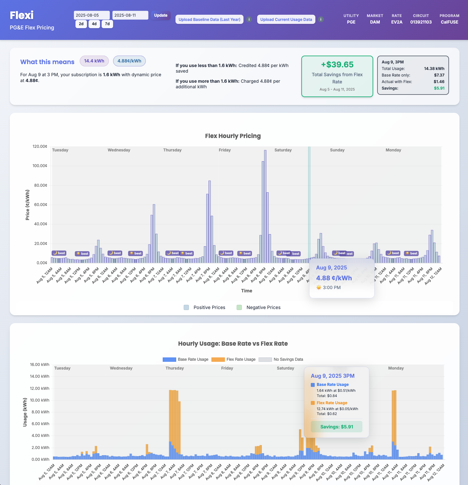

# flexi

Inital proof of concept for managing 
[PG&E Flex Hourly Pricing Pilot](https://www.pge.com/en/account/rate-plans/find-your-best-rate-plan/hourly-flex-pricing.html).
The goal is to understand the forecasted hourly prices and compare
it to my historical usage 1 year ago to ensure I maximize savings.

API integration: https://api-calculate-docs.gridx.com/acgd/api-introduction-overview

## Pilot summary

- This pilot runs from November 1, 2024, to December 31, 2027.
- Electricity prices vary by hour. They are forecast seven days in advance and are set one day in advance. Final prices are set at 4 p.m. a day in advance.
- You receive a credit after each 12 months if you would have paid less on Hourly Flex Pricing compared to your current rate plan.
- This rate includes a subscription that is based on your energy use for the **same day and hour last year**. 
  - If you use more energy than your subscription quantity for an hour, the additional energy use will be charged at the dynamic price.
  - If you use less energy than your subscription quantity for an hour, you will be credited the difference at the dynamic hourly price.

## PoC

Initial visualization

